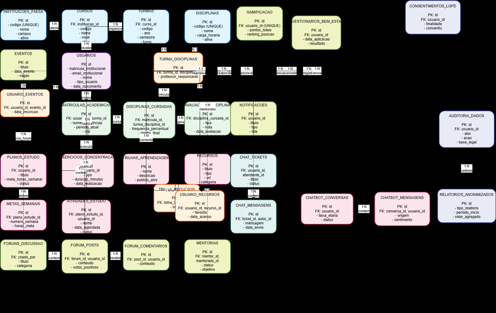
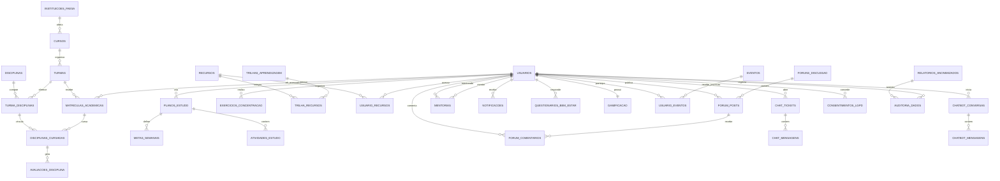

# Entrega Fase 2 - Diagrama Entidade-Relacionamento do Projeto

Disciplina: Desenvolvimento de Aplicacoes Web II (D001508)  
Projeto: Site de Acolhimento FAESA  
Aluno: Gabriel Malheiros de Castro  
Data: 2026-03-22

---

## 1. Descricao do Minimundo

O Site de Acolhimento FAESA e uma plataforma web para estudantes da propria FAESA, com foco em acolhimento academico, organizacao de estudos, bem-estar e suporte psicopedagogico. O sistema permite cadastro institucional, planos de estudo, cronograma, exercicios de concentracao, trilhas de aprendizagem, biblioteca de recursos, forum, mentoria, notificacoes, gamificacao, eventos e chat de suporte. O dominio academico considera multiplas instituicoes da rede FAESA (campi/unidades), com vinculo de cursos, turmas e disciplinas. Cada aluno possui historico academico por matricula, com avaliacoes por disciplina cursada. Para coordenacao, o sistema produz relatorios agregados e anonimizados. Para LGPD, registra consentimento, trilha de auditoria e governanca de dados.

### Entidades principais

- Usuario
- InstituicaoFAESA
- Curso
- Turma
- Disciplina
- MatriculaAcademica
- DisciplinaCursada
- AvaliacaoDisciplina
- PlanoEstudo
- MetaSemanal
- AtividadeEstudo
- ExercicioConcentracao
- TrilhaAprendizagem
- Recurso
- ForumDiscussao
- ForumPost
- ForumComentario
- Mentoria
- Notificacao
- QuestionarioBemEstar
- Gamificacao
- Evento
- ChatTicket
- ChatMensagem
- ChatbotConversa
- ChatbotMensagem
- RelatorioAnonimizado
- ConsentimentoLGPD
- AuditoriaDados

---

## 2. Diagrama Entidade-Relacionamento (DER)

### 2.1 Cardinalidades na pratica

- InstituicaoFAESA 1:N Curso
- Curso 1:N Turma
- Turma N:M Disciplina (via TurmaDisciplina)
- Usuario 1:N MatriculaAcademica
- Turma 1:N MatriculaAcademica
- MatriculaAcademica 1:N DisciplinaCursada
- TurmaDisciplina 1:N DisciplinaCursada
- DisciplinaCursada 1:N AvaliacaoDisciplina
- Usuario 1:N PlanoEstudo
- PlanoEstudo 1:N MetaSemanal
- PlanoEstudo 1:N AtividadeEstudo
- Usuario N:M Recurso (via UsuarioRecurso)
- TrilhaAprendizagem N:M Recurso (via TrilhaRecurso)
- ForumDiscussao 1:N ForumPost
- ForumPost 1:N ForumComentario
- Usuario 1:N Mentoria (como mentor)
- Usuario 1:N Mentoria (como mentorado)
- Usuario 1:N Notificacao
- Usuario 1:1 Gamificacao
- Evento N:M Usuario (via UsuarioEvento)
- ChatTicket 1:N ChatMensagem
- Usuario 1:N ChatbotConversa
- ChatbotConversa 1:N ChatbotMensagem
- Usuario 1:N ConsentimentoLGPD
- Usuario 1:N AuditoriaDados

### 2.2 DER em representacao visual (formato de submissao)

Imagem final do DER (obrigatoria para entrega):

Se necessario refinar layout e legibilidade apos exportacao inicial:

Nota tecnica:
- O DER visual deve explicitar entidades, relacionamentos e cardinalidades no proprio desenho.
- PK/FK e atributos detalhados permanecem na secao 3 (mapeamento relacional).
- Em caso de baixa legibilidade no diagrama unico, usar 4 subdiagramas por dominio (academico, planejamento, comunidade e operacoes/compliance).

### 2.3 Fonte tecnica do DER (Mermaid)

Observacao: exportar a secao Mermaid em PNG/SVG no Mermaid Live Editor e salvar em `docs/relatorios faesa/` com os nomes usados nesta secao.

---

## 3. Mapeamento para Modelo Relacional

Abaixo esta a lista de tabelas resultantes do DER, com PK, FKs e tipos de dados principais (PostgreSQL).

### 3.1 Dominio academico

1. instituicoes_faesa  
PK: id BIGSERIAL  
Colunas: codigo VARCHAR(20) UNIQUE, nome VARCHAR(255), campus VARCHAR(120), ativo BOOLEAN

2. cursos  
PK: id BIGSERIAL  
FK: instituicao_id -> instituicoes_faesa.id  
Colunas: codigo VARCHAR(30), nome VARCHAR(255), nivel VARCHAR(40), ativo BOOLEAN

3. turmas  
PK: id BIGSERIAL  
FK: curso_id -> cursos.id  
Colunas: codigo VARCHAR(40), ano INT, semestre INT, turno VARCHAR(20), status VARCHAR(20)

4. disciplinas  
PK: id BIGSERIAL  
Colunas: codigo VARCHAR(30) UNIQUE, nome VARCHAR(255), carga_horaria INT, ativa BOOLEAN

5. turma_disciplinas  
PK: id BIGSERIAL  
FKs: turma_id -> turmas.id, disciplina_id -> disciplinas.id  
Colunas: ano INT, semestre INT, professor_responsavel VARCHAR(255)

6. usuarios  
PK: id BIGSERIAL  
Colunas: matricula_institucional VARCHAR(30) UNIQUE, email_institucional VARCHAR(255) UNIQUE, nome VARCHAR(255), tipo_usuario VARCHAR(30), data_nascimento DATE, created_at TIMESTAMP

7. matriculas_academicas  
PK: id BIGSERIAL  
FKs: usuario_id -> usuarios.id, turma_id -> turmas.id  
Colunas: numero_matricula VARCHAR(40) UNIQUE, periodo_atual INT, cra NUMERIC(4,2), status VARCHAR(20), data_ingresso DATE, data_fim DATE

8. disciplinas_cursadas  
PK: id BIGSERIAL  
FKs: matricula_id -> matriculas_academicas.id, turma_disciplina_id -> turma_disciplinas.id  
Colunas: frequencia_percentual NUMERIC(5,2), media_final NUMERIC(4,2), situacao VARCHAR(20)

9. avaliacoes_disciplina  
PK: id BIGSERIAL  
FK: disciplina_cursada_id -> disciplinas_cursadas.id  
Colunas: tipo VARCHAR(50), descricao VARCHAR(255), nota NUMERIC(4,2), peso NUMERIC(4,2), data_avaliacao DATE

### 3.2 Planejamento e aprendizagem

10. planos_estudo  
PK: id BIGSERIAL  
FK: usuario_id -> usuarios.id  
Colunas: titulo VARCHAR(255), descricao TEXT, meta_horas_semanal INT, meta_horas_mensal INT, data_inicio DATE, data_fim DATE, status VARCHAR(20)

11. metas_semanais  
PK: id BIGSERIAL  
FK: plano_estudo_id -> planos_estudo.id  
Colunas: numero_semana INT, horas_meta INT, horas_realizadas INT

12. atividades_estudo  
PK: id BIGSERIAL  
FKs: plano_estudo_id -> planos_estudo.id, usuario_id -> usuarios.id  
Colunas: nome VARCHAR(255), descricao TEXT, data_agendada TIMESTAMP, data_realizacao TIMESTAMP, duracao_minutos INT, status VARCHAR(20)

13. exercicios_concentracao  
PK: id BIGSERIAL  
FK: usuario_id -> usuarios.id  
Colunas: tipo VARCHAR(30), duracao_minutos INT, data_realizacao TIMESTAMP, pontos_ganhos INT

14. trilhas_aprendizagem  
PK: id BIGSERIAL  
Colunas: nome VARCHAR(255), descricao TEXT, publico_alvo VARCHAR(120)

15. recursos  
PK: id BIGSERIAL  
Colunas: titulo VARCHAR(255), descricao TEXT, tipo VARCHAR(30), url VARCHAR(600), categoria VARCHAR(100), visualizacoes INT

16. trilha_recursos  
PK: id BIGSERIAL  
FKs: trilha_id -> trilhas_aprendizagem.id, recurso_id -> recursos.id  
Colunas: ordem INT

17. usuario_recursos  
PK: id BIGSERIAL  
FKs: usuario_id -> usuarios.id, recurso_id -> recursos.id  
Colunas: data_acesso TIMESTAMP, favorito BOOLEAN

### 3.3 Comunidade e suporte

18. foruns_discussao  
PK: id BIGSERIAL  
FK: criado_por -> usuarios.id  
Colunas: titulo VARCHAR(255), descricao TEXT, categoria VARCHAR(30), created_at TIMESTAMP

19. forum_posts  
PK: id BIGSERIAL  
FKs: forum_id -> foruns_discussao.id, usuario_id -> usuarios.id  
Colunas: conteudo TEXT, votos_positivos INT, created_at TIMESTAMP

20. forum_comentarios  
PK: id BIGSERIAL  
FKs: post_id -> forum_posts.id, usuario_id -> usuarios.id  
Colunas: conteudo TEXT, created_at TIMESTAMP

21. mentorias  
PK: id BIGSERIAL  
FKs: mentor_id -> usuarios.id, mentorado_id -> usuarios.id  
Colunas: status VARCHAR(20), data_inicio DATE, data_fim DATE, objetivo TEXT

22. notificacoes  
PK: id BIGSERIAL  
FK: usuario_id -> usuarios.id  
Colunas: titulo VARCHAR(255), mensagem TEXT, tipo VARCHAR(30), lida BOOLEAN, data_criacao TIMESTAMP

23. questionarios_bem_estar  
PK: id BIGSERIAL  
FK: usuario_id -> usuarios.id  
Colunas: data_aplicacao TIMESTAMP, respostas JSONB, resultado VARCHAR(20), observacoes TEXT

24. gamificacao  
PK: id BIGSERIAL  
FK: usuario_id -> usuarios.id (UNIQUE)  
Colunas: pontos_totais INT, badges JSONB, ranking_posicao INT

25. eventos  
PK: id BIGSERIAL  
Colunas: titulo VARCHAR(255), descricao TEXT, tipo VARCHAR(30), data_evento TIMESTAMP, local VARCHAR(255), vagas INT

26. usuario_eventos  
PK: id BIGSERIAL  
FKs: usuario_id -> usuarios.id, evento_id -> eventos.id  
Colunas: data_inscricao TIMESTAMP, presenca_confirmada BOOLEAN

27. chat_tickets  
PK: id BIGSERIAL  
FKs: usuario_id -> usuarios.id, atendente_id -> usuarios.id  
Colunas: titulo VARCHAR(255), descricao TEXT, status VARCHAR(20), data_criacao TIMESTAMP, data_fechamento TIMESTAMP

28. chat_mensagens  
PK: id BIGSERIAL  
FKs: ticket_id -> chat_tickets.id, autor_id -> usuarios.id  
Colunas: mensagem TEXT, data_envio TIMESTAMP

### 3.4 Cobertura RF16, RF14 e LGPD

29. chatbot_conversas  
PK: id BIGSERIAL  
FK: usuario_id -> usuarios.id  
Colunas: faixa_etaria VARCHAR(10), canal VARCHAR(30), status VARCHAR(20), iniciou_em TIMESTAMP, encerrou_em TIMESTAMP

30. chatbot_mensagens  
PK: id BIGSERIAL  
FKs: conversa_id -> chatbot_conversas.id, usuario_id -> usuarios.id (NULL para resposta automatica)  
Colunas: origem VARCHAR(20), conteudo TEXT, intencao VARCHAR(80), sentimento VARCHAR(30), data_envio TIMESTAMP

31. relatorios_anonimizados  
PK: id BIGSERIAL  
Colunas: tipo_relatorio VARCHAR(40), periodo_inicio DATE, periodo_fim DATE, dimensao VARCHAR(60), valor_agregado NUMERIC(12,2), total_registros INT, gerado_em TIMESTAMP

32. consentimentos_lgpd  
PK: id BIGSERIAL  
FK: usuario_id -> usuarios.id  
Colunas: finalidade VARCHAR(100), versao_termo VARCHAR(20), consentiu BOOLEAN, ip_origem VARCHAR(45), user_agent TEXT, data_consentimento TIMESTAMP

33. auditoria_dados  
PK: id BIGSERIAL  
FKs: usuario_id -> usuarios.id, relatorio_id -> relatorios_anonimizados.id (NULL)  
Colunas: ator VARCHAR(30), acao VARCHAR(30), entidade VARCHAR(60), entidade_id BIGINT, base_legal VARCHAR(60), finalidade VARCHAR(100), data_evento TIMESTAMP

Total: 33 tabelas mapeadas.

---

## 4. Escolha e Justificativa do Banco de Dados

### 4.1 SGBD escolhido

PostgreSQL 16+ (Supabase)

### 4.2 Justificativa tecnica

- O modelo possui relacionamentos fortes e diversas FKs, exigindo integridade referencial nativa.
- O dominio academico possui regras de consistencia que favorecem transacoes ACID.
- RF14 exige agregacao analitica de dados para coordenacao, com consultas SQL e JOINs.
- RF16 pode usar dados relacionais para contexto de usuario e historico de conversa.
- RNF09 (LGPD) precisa trilha de consentimento e auditoria estruturada em tabelas.
- Supabase oferece PostgreSQL gerenciado, autenticacao integrada e compatibilidade com deploy serverless.

### 4.3 ORM escolhido

Prisma ORM

### 4.4 Justificativa do ORM

- Type-safe com TypeScript, reduzindo erros de consulta.
- Migrations versionadas para evolucao do esquema.
- Boa integracao com PostgreSQL/Supabase e arquitetura Node.js/Next.js/NestJS.
- Produtividade maior para CRUD e relatorios sem perder rastreabilidade de schema.

---

## 5. Confirmacao de aderencia aos requisitos do projeto

- RF14: coberto por relatorios_anonimizados e estrutura agregada.
- RF16: coberto por chatbot_conversas e chatbot_mensagens com faixa etaria.
- RNF09/LGPD: coberto por consentimentos_lgpd e auditoria_dados.
- Regra de negocio apenas FAESA: coberta por instituicoes_faesa e cadastro institucional.
- Avaliacoes por disciplina: cobertas via disciplinas_cursadas -> avaliacoes_disciplina.

---

## 6. Referencias de base

- Especificacao de requisitos da Fase 1
- Documento principal do projeto
- Diretrizes da atividade de DER (Fase 2)
